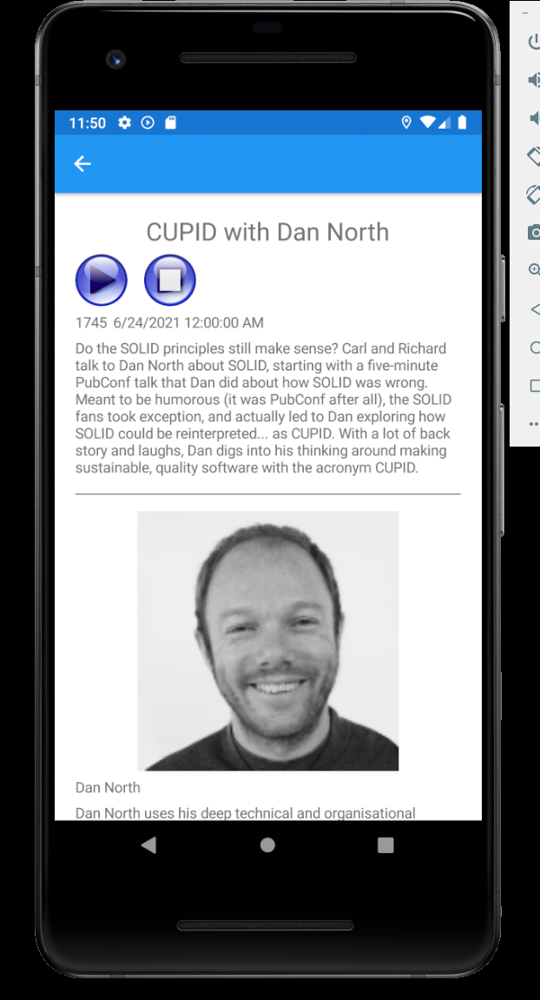
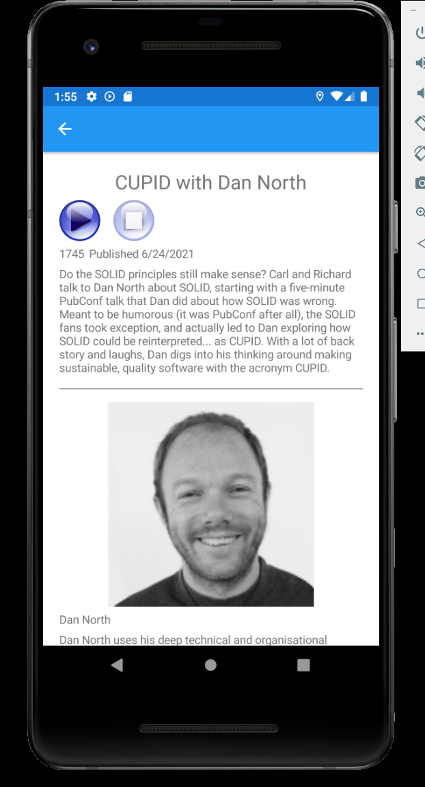
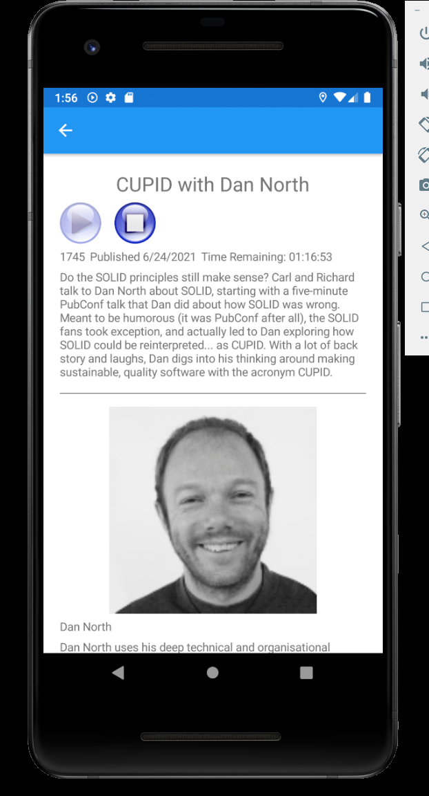
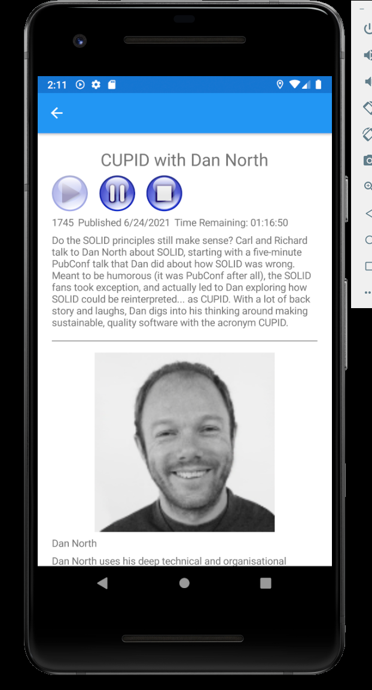
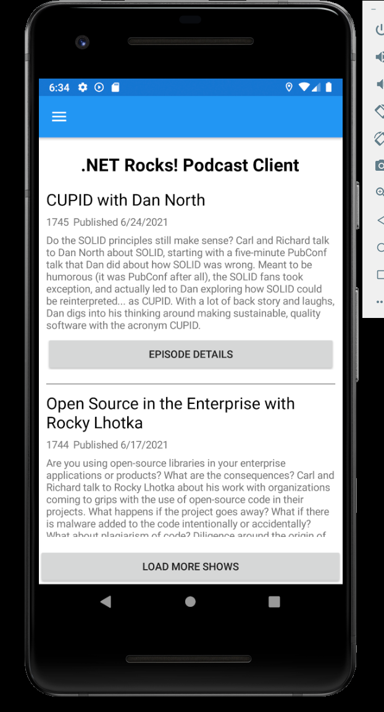

# The .NET Show Episode 7

###### Building a Mobile Podcast App Part 5

See more projects at https://github.com/carlfranklin/DotNetShow

Watch the video at https://youtu.be/LAXzQNOBVIU

All episodes are listed at https://thedotnetshow.com

## Overview

Starting with episode 2 of The .NET Show, I am building a mobile podcast app for my podcast, .NET Rocks! using Xamarin Forms. 

At this point our app has a Home Page which shows the first 20 episodes of the podcast. The user can load more episodes (20 at a time). For each episode, we provide a button so the user can see the details and play the podcast.

However, the user can only **Play** and **Stop**. There is no **Pause** function. Nor is there a way to scrub - or jump to a specific location in the audio.

In this episode we will:

- Provide controls for **Play**, **Pause**, **Resume**, and **Stop**.
- Provide  **Scrub** control.
- Provide controls to **Rewind** and **Fast Forward** by 10 seconds.

### Step 25 - Add Media Buttons

I downloaded a .PNG file containing media buttons from 
https://pixabay.com/vectors/multimedia-controls-buttons-play-154187/

Pixbay License (from their website):
	*Free for commercial use*
	*No attribution required*

You can download the individual buttons at https://github.com/carlfranklin/MobileDnr5/tree/master/media-icons

Here is the composite image:


This is the .NET 4 console app I wrote to extract the individual icons from the composite image:

```c#
using System;
using System.Collections.Generic;
using System.Linq;
using System.Text;
using System.Threading.Tasks;
using System.IO;
using System.Drawing;

namespace GenIcons
{
    class Program
    {
        static void Main(string[] args)
        {
            // Change to your path
            string path = @"D:\Repos\!MobileDnr\MobileDnr5\media-icons\";
            
            string composite = path + "multimedia-154187_1280.png";
            var img = Image.FromFile(composite);

            int top = 235;
            int width = 170;
            int height = 170;

            string rew = path + "rewind.png";
            var rect = new Rectangle(185, top, width, height);
            var rewindImg = Crop(img, rect);
            rewindImg.Save(rew, System.Drawing.Imaging.ImageFormat.Png);

            string ffwd = path + "ffwd.png";
            rect = new Rectangle(371, top, width, height);
            var ffwdImage = Crop(img, rect);
            ffwdImage.Save(ffwd, System.Drawing.Imaging.ImageFormat.Png);

            string play = path + "play.png";
            rect = new Rectangle(556, top, width, height);
            var playImg = Crop(img, rect);
            playImg.Save(play, System.Drawing.Imaging.ImageFormat.Png);

            string pause = path + "pause.png";
            rect = new Rectangle(741, top, width, height);
            var pauseImg = Crop(img, rect);
            pauseImg.Save(pause, System.Drawing.Imaging.ImageFormat.Png);

            string stop = path + "stop.png";
            rect = new Rectangle(927, top +2, width-2, height-2);
            var stopImg = Crop(img, rect);
            // I had to resize this one to 170x170.
            var resizedStopImg = (Image)(new Bitmap(stopImg, 170, 170));
            resizedStopImg.Save(stop, System.Drawing.Imaging.ImageFormat.Png);
            
        }

        static Image Crop(Image img, Rectangle Rect)
        {
            Bitmap bmpImage = new Bitmap(img);
            return bmpImage.Clone(Rect, bmpImage.PixelFormat);
        }
    }
}
```

Copy the individual media control buttons (*ffwd.png*, *pause.png*, *play.png*, *rewind.png*, and *stop.png*) to the following folders in your project:

- *DotNetRocks.Android/Resources/drawable*
- *DotNetRocks.iOS/Resources*

Also, copy *thumb.png* to the same folders. We will use this as the thumb to the `Slider` control, which we will add later.

### Step 26 - Replace Play and Stop buttons

In the *DetailPage.xaml* file, replace the definition for the **Play** and **Stop** buttons with this:

```xaml
<StackLayout Orientation="Horizontal">
    <ImageButton Source="play.png"
                 WidthRequest="50"
                 BackgroundColor="White"
                 IsEnabled="{Binding IsPlaying, 
                            Converter={StaticResource InverseBoolConverter}}"
                 Command="{Binding Play}" />
    <ImageButton Source="stop.png" 
                 Margin="10,0,0,0"
                 WidthRequest="50"
                 BackgroundColor="White"
                 IsEnabled="{Binding IsPlaying}" 
                 Command="{Binding Stop}" />
</StackLayout>
```

Note that the buttons are now `ImageButton` types, and they are placed next to each other in a horizontal `StackLayout` with 10 pixels between them. I also set the `BackgroundColor` properties to "White" because I noticed they had little bits of grey poking out of the corners. 

I also changed the binding of `IsVisible` to `IsEnabled` because I wanted the buttons to be visible but only enabled depending on the value of `IsPlaying`. I was assuming that the buttons would appear greyed out when disabled, but that is not the case. Here's what it looks like:




However, that's not the worst part. They flash a grey background when clicked. I have searched the Internets for a solution to this. I came to the conclusion that the `ImageButton` isn't going to work.

Instead I chose to use a regular `Image` control with a `GestureRecognizer` to handle the click. Turns out we can use our existing commands, too.

One enhancement I made was to create a `PlayingToOpacityConverter` Value Converter which would give the button images an Opacity value based on whether or not we are playing. 

Add the following class to the **DotNetRocks** project:

*PlayingToOpacityConverter.cs*

```c#
using System;
using System.Collections.Generic;
using System.Globalization;
using System.Text;
using Xamarin.Forms;

namespace DotNetRocks
{
    public class PlayingToOpacityConverter : IValueConverter
    {
        public object Convert(object value, Type targetType, 
                              object parameter, CultureInfo culture)
        {
            if ((bool)value)
            {
                if (parameter != null && System.Convert.ToInt32(parameter) == 1)
                {
                    return (double)0.4; // Play button Opacity when IsPlaying is true
                }
                else
                {
                    return (double)1.0; // Stop button Opacity when IsPlaying is true
                }
            }
            else
            {
                if (parameter != null && System.Convert.ToInt32(parameter) == 1)
                {
                    return (double)1.0; // Play button Opacity when IsPlaying is false
                }
                else
                {
                    return (double)0.4; // Stop button Opacity when IsPlaying is false
                }
            }
        }

        public object ConvertBack(object value, Type targetType, 
                                  object parameter, CultureInfo culture)
        {
            throw new NotImplementedException();
        }
    }
}
```

Note that I'm using a `CommandParameter` here. If we pass in a value of 1, that means we're getting a value for the **Play** button. 

Add the new `PlayingToOpacityConverter` to the `<ContentPage.Resources>` section:

```xaml
<ContentPage.Resources>
    <local:InverseBoolConverter x:Key="InverseBoolConverter"/>
    <local:PlayingToOpacityConverter x:Key="PlayingToOpacityConverter"/>
</ContentPage.Resources>
```

Now change our new horizontal `StackPanel` of buttons to this:

```xaml
<StackLayout Orientation="Horizontal" HeightRequest="50" >
    <Image Source="play.png" IsEnabled="{Binding IsPlaying, 
           Converter={StaticResource InverseBoolConverter}}"
           Opacity="{Binding IsPlaying, Converter={StaticResource
                    PlayingToOpacityConverter}, 
                    ConverterParameter=1}">
        <Image.GestureRecognizers>
            <TapGestureRecognizer NumberOfTapsRequired="1" 
                                  Command="{Binding Play}" />
        </Image.GestureRecognizers>
    </Image>
    <Image Source="stop" 
           Margin="10,0,0,0"
           IsEnabled="{Binding IsPlaying}" 
           Opacity="{Binding IsPlaying, Converter={StaticResource
                    PlayingToOpacityConverter}}">
        <Image.GestureRecognizers>
            <TapGestureRecognizer NumberOfTapsRequired="1" 
                                  Command="{Binding Stop}" />
        </Image.GestureRecognizers>
    </Image>
</StackLayout>
```

At first I tried binding Opacity `IsEnabled`, but because the value is dependent on the `InverseBoolConverter` the value is always `True`.

Before we move on, I want to fix a couple UI issues. First of all, the date published is displayed with the time as well. The bug is in the `StringFormat`. We need to set it to `{0:d}` rather than just `{d}` to get that to work. 

Also, I want to move the status label into the horizontal `StackPanel` that shows the episode and date published.

Replace the status `Label` and informational `StackPanel` with this:

```xaml
<StackLayout Orientation="Horizontal">
    <Label Text="{Binding CurrentShow.ShowNumber}" />
    <Label Text="{Binding CurrentShow.DatePublished, StringFormat='Published {0:d}'}" />
    <Label Text="{Binding CurrentStatus}" />
</StackLayout>
```

Now the detail page looks like this when not playing:



And like this when playing:



### Step 27 - Add a Pause button

Now that everything is in place, adding a **Pause** button turns out to be really easy.

Let's update the `DetailPageViewModel` first.

Add the following class-level variable at the top of the class:

```c#
bool IsPaused = false;
```

We need to know that we are paused, so we can resume when **Play** is pressed after being paused.

Next, add the following code somewhere in the ViewModel:

```c#
private ICommand pause;
public ICommand Pause
{
    get
    {
        if (pause == null)
        {
            pause = new AsyncCommand(PerformPause);
        }
        return pause;
    }
}

public async Task PerformPause()
{
    IsPlaying = false;
    IsPaused = true;
    CurrentStatus = "";
    await CrossMediaManager.Current.Pause();
}
```

Note that we set `IsPaused` to `true` when pausing.

Now we need to modify `PerformPlay` to handle resuming:

```c#
private async Task PerformPlay()
{
    IsPlaying = true;

    if (IsPaused)
    {
        await CrossMediaManager.Current.PlayPause();
    }
    else
    {
        if (!IsCached)
        {
            // Not in cache. Play from URL
            CurrentStatus = "Downloading...";
            await CrossMediaManager.Current.Play(CurrentShow.ShowDetails.File.Url);
            // Download the file to the cache
            DownloadFile();
        }
        else
        {
            // In the cache. Play local file
            CurrentStatus = "Playing from Cache...";
            LocalFileStream = System.IO.File.OpenRead(CachedFileName);
            await CrossMediaManager.Current.Play(LocalFileStream, Mp3FileName);
        }
    }
    IsPaused = false;
}
```

This code should be pretty self-explanatory. If we are paused, we just call `CrossMediaManager.Current.PlayPause()` to resume, otherwise we do our normal logic to play either from the cache or download. At the end of the method we are clearing the `IsPaused` flag.

Now we are ready to add the **Pause** button. Wedge this between the **Play** and **Stop** buttons (Images) in *DetailPage.xaml*:

```xaml
<Image Source="pause" 
       Margin="10,0,0,0"
       IsEnabled="{Binding IsPlaying}" 
       Opacity="{Binding IsPlaying, Converter={StaticResource
                PlayingToOpacityConverter}}">
    <Image.GestureRecognizers>
        <TapGestureRecognizer NumberOfTapsRequired="1" 
                              Command="{Binding Pause}" />
    </Image.GestureRecognizers>
</Image>
```

If you copied this from the `Stop` implementation, the only things that change are the source image (pause) and the Command.

When we run we see this:


When playing, the **Pause** button is enabled. 



If you press **Play** after pressing **Pause**, playback will resume. If you press **Play** after pressing **Stop**, playback will start over from the beginning.

### Step 28 - Add Rewind and Fast Forward features

Add the following to the `DetailPageViewModel`

```c#
private ICommand rewind;
public ICommand Rewind
{
    get
    {
        if (rewind == null)
        {
            rewind = new Command(PerformRewind);
        }
        return rewind;
    }
}

public void PerformRewind()
{
    var TenSeconds = TimeSpan.FromSeconds(10);
    if (CrossMediaManager.Current.Position > TenSeconds)
        CrossMediaManager.Current.SeekTo(CrossMediaManager.Current.
                                         Position.Subtract(TenSeconds));
    else
        CrossMediaManager.Current.SeekToStart();
}


private ICommand fastforward;
public ICommand FastForward
{
    get
    {
        if (fastforward == null)
        {
            fastforward = new Command(PerformFastForward);
        }
        return fastforward;
    }
}

public void PerformFastForward()
{
    var TenSeconds = TimeSpan.FromSeconds(10);
    var LastTen = CrossMediaManager.Current.Duration.Subtract(TenSeconds);
    if (CrossMediaManager.Current.Position < LastTen)
        CrossMediaManager.Current.SeekTo(CrossMediaManager.Current
                                          .Position.Add(TenSeconds));
}
```

Here, I'm simply using the `CrossMediaManager.Current.SeekTo` method to start playing from the calculated position.

Replace the entire `StackPanel` of buttons to this:

```xaml
<StackLayout Orientation="Horizontal" 
             HeightRequest="50" 
             HorizontalOptions="Center" >
    <Image Source="rewind" 
           IsEnabled="{Binding IsPlaying}" 
           Opacity="{Binding IsPlaying, Converter={StaticResource
                    PlayingToOpacityConverter}}">
        <Image.GestureRecognizers>
            <TapGestureRecognizer NumberOfTapsRequired="1" 
                                  Command="{Binding Rewind}" />
        </Image.GestureRecognizers>
    </Image>
    <Image Source="play.png" 
           Margin="10,0,0,0"
           IsEnabled="{Binding IsPlaying, 
                      Converter={StaticResource InverseBoolConverter}}"
           Opacity="{Binding IsPlaying, Converter={StaticResource
                    PlayingToOpacityConverter}, 
                    ConverterParameter=1}">
        <Image.GestureRecognizers>
            <TapGestureRecognizer NumberOfTapsRequired="1" 
                                  Command="{Binding Play}" />
        </Image.GestureRecognizers>
    </Image>
    <Image Source="pause" 
           Margin="10,0,0,0"
           IsEnabled="{Binding IsPlaying}" 
           Opacity="{Binding IsPlaying, Converter={StaticResource
                    PlayingToOpacityConverter}}">
        <Image.GestureRecognizers>
            <TapGestureRecognizer NumberOfTapsRequired="1" 
                                  Command="{Binding Pause}" />
        </Image.GestureRecognizers>
    </Image>
    <Image Source="stop" 
           Margin="10,0,0,0"
           IsEnabled="{Binding IsPlaying}" 
           Opacity="{Binding IsPlaying, Converter={StaticResource
                    PlayingToOpacityConverter}}">
        <Image.GestureRecognizers>
            <TapGestureRecognizer NumberOfTapsRequired="1" 
                                  Command="{Binding Stop}" />
        </Image.GestureRecognizers>
    </Image>
    <Image Source="ffwd" 
           Margin="10,0,0,0"
           IsEnabled="{Binding IsPlaying}" 
           Opacity="{Binding IsPlaying, Converter={StaticResource
                    PlayingToOpacityConverter}}">
        <Image.GestureRecognizers>
            <TapGestureRecognizer NumberOfTapsRequired="1" 
                                  Command="{Binding FastForward}" />
        </Image.GestureRecognizers>
    </Image>
</StackLayout>
```

Try it out! Notice that the buttons are now centered in the page.

### Step 29 - Add a Slider bar

Before we add the slider, we need a couple properties to bind it to. 

Add the following to *DetailPageViewModel.cs*:

```c#
public string CurrentPositionString
{
    get
    {
        TimeSpan currentMediaPosition = CrossMediaManager.Current.Position;
        if (IsPlaying)
        {
            var value = "";
            if (currentMediaPosition.Hours == 0)
            {
                value = $"{currentMediaPosition.Minutes:D1}:{currentMediaPosition.Seconds:D2}";
            }
            else
            {
                value = $"{currentMediaPosition.Hours:D1}:{currentMediaPosition.Minutes:D2}:{currentMediaPosition.Seconds:D2}";
            }
            return value;
        }
        else
            return "";
    }
}


public double CurrentPosition
{
    get
    {
        if (CrossMediaManager.Current == null)
            return (double)0;
        else
        {
            if (CrossMediaManager.Current.Position.TotalMilliseconds == 0)
                return (double)0;
            else
                return CrossMediaManager.Current.Position.TotalMilliseconds
                / CrossMediaManager.Current.Duration.TotalMilliseconds;
        }
    }
    set
    {
        var newPosition = TimeSpan.FromMilliseconds(value *                                                  CrossMediaManager.Current.Duration.TotalMilliseconds);
        CrossMediaManager.Current.SeekTo(newPosition);
    }
}
```

`CurrentPositionString` will show the current position as a formatted string, much like the time left that shows in `CurrentStatus`. 

`CurrentPosition` is what we will bind the `Slider` control's `Value` property to. The `Value` property is a double between 0 and 1. By dividing the `CrossMediaManager.Current.Position.TotalMilliseconds` by `CrossMediaManager.Current.Duration.TotalMilliseconds` we get the position as a decimal value between 0 and 1. To set the position, we get the position in milliseconds by multiplying the value by `CrossMediaManager.Current.Duration.TotalMilliseconds`.

Add the following to *DetailPage.xaml* after the horizontal `StackPanel` that shows the buttons:

```xaml
<StackLayout Orientation="Horizontal" Margin="0,10,0,10">
    <Label Text="{Binding CurrentPositionString}" WidthRequest="55"
           VerticalOptions="Center" />
    <Slider IsEnabled="{Binding IsPlaying}"
            HorizontalOptions="FillAndExpand"
            Value="{Binding CurrentPosition}" 
            HeightRequest="30"
            ThumbImageSource="thumb"
            BackgroundColor="DarkGray"
            />
</StackLayout>
```

Notice that the `ThumbImageSource` property is set to "thumb". The default thumb is too small for my liking, so I created a simple rectangle with button-style shading.

The `CurrentPositionString` is shown to the left of the slider. When we are done, it will look like this:


But, we're not done yet! We need to add a couple lines of code to the PositionChanged event handler.  Let's replace it with the following:

```c#
private void Current_PositionChanged(object sender,
        MediaManager.Playback.PositionChangedEventArgs e)
{
    TimeSpan currentMediaPosition = CrossMediaManager.Current.Position;
    TimeSpan currentMediaDuration = CrossMediaManager.Current.Duration;
    TimeSpan TimeRemaining = currentMediaDuration.Subtract(currentMediaPosition);
    if (IsPlaying)
    {
        if (TimeRemaining.Hours == 0)
        {
            CurrentStatus = $"Time Remaining: {TimeRemaining.Minutes:D1}:{TimeRemaining.Seconds:D2}";
        }
        else
        {
            CurrentStatus = $"Time Remaining: {TimeRemaining.Hours:D1}:{TimeRemaining.Minutes:D2}:{TimeRemaining.Seconds:D2}";
        }
        base.OnPropertyChanged("CurrentPosition");
        base.OnPropertyChanged("CurrentPositionString");
    }
}
```

We added these two lines:

```c#
        base.OnPropertyChanged("CurrentPosition");
        base.OnPropertyChanged("CurrentPositionString");
```

If you recall, the `BaseViewModel` class, from which our ViewModels inherit, has support for `INotifyPropertyChanged`. Any time we want we can call the `OnPropertyChanged` method to tell Xamarin Forms that the value of a property has been updated, so it can update the UI.

We also changed the string format of `TimeRemaining.Hours` to `D1`, which only shows one digit. I know, that won't work if an episode goes over 9 hours and 59 minutes, but hey - I can live with that. 

I made a few other minor tweaks to the UI. One was the format of Title label. I made the text black and bold. It seemed to need that little bit of contrast. I made the same change on the *HomePage.xaml* page.

Here's what my app looks like now:




So here, at the end of part 5, are the complete versions of all our major source files:

*HomePage.xaml*

```xaml
<?xml version="1.0" encoding="utf-8" ?>
<ContentPage xmlns="http://xamarin.com/schemas/2014/forms"
             xmlns:x="http://schemas.microsoft.com/winfx/2009/xaml"
             x:Class="DotNetRocks.Views.HomePage"
             xmlns:local="clr-namespace:DotNetRocks"
             xmlns:viewmodels="clr-namespace:DotNetRocks.ViewModels"
             xmlns:dxcv="http://schemas.devexpress.com/xamarin/2014/forms/collectionview"
             >

    <ContentPage.BindingContext>
        <viewmodels:HomePageViewModel/>
    </ContentPage.BindingContext>

    <ContentPage.Content>
        <StackLayout>
            <Label Margin="0,20,0,0"
                Text=".NET Rocks! Podcast Client"
                FontAttributes="Bold"
                TextColor="Black"
                FontSize="Title"
                VerticalOptions="StartAndExpand" 
                HorizontalOptions="CenterAndExpand" />
            <dxcv:DXCollectionView x:Name="MyCollectionView" 
                               ItemsSource="{Binding AllShows}">
                <dxcv:DXCollectionView.ItemTemplate>
                    <DataTemplate>
                        <StackLayout>
                            <Label Text="{Binding ShowTitle}" 
                                   TextColor="Black"
                                   FontSize="Large"/>
                            <StackLayout Orientation="Horizontal">
                                <Label Text="{Binding ShowNumber}" />
                                <Label Text="{Binding DatePublished, StringFormat='Published {0:d}'}" />
                            </StackLayout>
                            <Label Text="{Binding Description}" />
                            <Button Text="Episode Details"
                                    Command="{Binding GoToDetailsPage,
                                    Source={RelativeSource AncestorType={x:Type viewmodels:HomePageViewModel}}}"
                                    CommandParameter="{Binding ShowNumber}" />
                            <Line Stroke="Gray" X1="0" X2="500" StrokeThickness="2" Margin="0,10,0,10" />
                        </StackLayout>
                    </DataTemplate>
                </dxcv:DXCollectionView.ItemTemplate>
                <dxcv:DXCollectionView.Margin>
                    <OnIdiom x:TypeArguments="Thickness" Phone="10,10,10,10" Tablet="71,0,0,0"/>
                </dxcv:DXCollectionView.Margin>
            </dxcv:DXCollectionView>
            
            <Button Text="Load More Shows" Command="{Binding LoadMoreShows}" />
            
        </StackLayout>
    </ContentPage.Content>
</ContentPage>
```

*HomePageViewModel.cs*:

```c#
using System;
using System.Collections.Generic;
using System.Windows.Input;
using System.Threading.Tasks;
using System.Linq;
using Xamarin.Forms;
using MvvmHelpers;
using MvvmHelpers.Commands;
using DotNetRocks.Services;
using DotNetRocks.Models;
using DotNetRocks.Views;

namespace DotNetRocks.ViewModels
{
    public class HomePageViewModel : BaseViewModel
    {
        private ApiService ApiService = new ApiService();
        public List<int> ShowNumbers { get; set; } = new List<int>();
        public int RecordsToRead { get; set; } = 20;
        public int LastShowNumber { get; set; }

        public HomePageViewModel()
        {
            var t = Task.Run(() => GetNextBatchOfShows());
            t.Wait();
        }

        public async Task GetNextBatchOfShows()
        {
            if (ShowNumbers.Count == 0)
            {
                ShowNumbers = await ApiService.GetShowNumbers();
                if (ShowNumbers == null || ShowNumbers.Count == 0) return;
                LastShowNumber = ShowNumbers.First<int>() + 1;
            }

            var request = new GetByShowNumbersRequest()
            {
                ShowName = "dotnetrocks",
                Indexes = (from x in ShowNumbers 
                           where x < LastShowNumber 
                           && x > (LastShowNumber - RecordsToRead) select x).ToList()
            };

            var nextBatch = await ApiService.GetByShowNumbers(request);
            if (nextBatch == null || nextBatch.Count == 0) return;

            AllShows.AddRange(nextBatch);
            LastShowNumber = nextBatch.Last<Show>().ShowNumber;
        }

        public async Task NavigateToDetailPage(int ShowNumber)
        {
            var route = $"{nameof(DetailPage)}?ShowNumber={ShowNumber}";
            await Shell.Current.GoToAsync(route);
        }

        private ICommand goToDetailsPage;
        public ICommand GoToDetailsPage
        {
            get
            {
                if (goToDetailsPage == null)
                {
                    goToDetailsPage = new AsyncCommand<int>(NavigateToDetailPage);
                }
                return goToDetailsPage;
            }
        }

        private ICommand loadMoreShows;
        public ICommand LoadMoreShows
        {
            get
            {
                if (loadMoreShows == null)
                {
                    loadMoreShows = new AsyncCommand(GetNextBatchOfShows);
                }
                return loadMoreShows;
            }
        }

        private List<Show> allShows = new List<Show>();
        public List<Show> AllShows
        {
            get => allShows;
            set => SetProperty(ref allShows, value);
        }
    }
}
```

*DetailPage.xaml* :

```xaml
<?xml version="1.0" encoding="utf-8" ?>
<ContentPage xmlns="http://xamarin.com/schemas/2014/forms"
             xmlns:x="http://schemas.microsoft.com/winfx/2009/xaml"
             xmlns:local="clr-namespace:DotNetRocks"
             xmlns:viewmodels="clr-namespace:DotNetRocks.ViewModels"
             xmlns:dxcv="http://schemas.devexpress.com/xamarin/2014/forms/collectionview"
             x:Class="DotNetRocks.Views.DetailPage">

    <ContentPage.BindingContext>
        <viewmodels:DetailPageViewModel/>
    </ContentPage.BindingContext>

    <ContentPage.Resources>
        <local:InverseBoolConverter x:Key="InverseBoolConverter"/>
        <local:PlayingToOpacityConverter x:Key="PlayingToOpacityConverter"/>
    </ContentPage.Resources>

    <ContentPage.Content>
        <StackLayout>
            <ScrollView IsVisible="{Binding IsReady}">
                <StackLayout Margin="20" >
                    <Label Text="{Binding CurrentShow.ShowTitle}"
                        FontSize="Title"
                        FontAttributes="Bold"
                        TextColor="Black"
                        VerticalOptions="Start" 
                        HorizontalOptions="CenterAndExpand" />
                    <StackLayout Orientation="Horizontal" 
                                 HeightRequest="50" 
                                 HorizontalOptions="Center" >
                        <Image Source="rewind" 
                            IsEnabled="{Binding IsPlaying}" 
                            Opacity="{Binding IsPlaying, Converter={StaticResource
                                        PlayingToOpacityConverter}}">
                            <Image.GestureRecognizers>
                                <TapGestureRecognizer NumberOfTapsRequired="1" 
                                  Command="{Binding Rewind}" />
                            </Image.GestureRecognizers>
                        </Image>
                        <Image Source="play.png" 
                            Margin="10,0,0,0"
                            IsEnabled="{Binding IsPlaying, 
                                    Converter={StaticResource InverseBoolConverter}}"
                            Opacity="{Binding IsPlaying, Converter={StaticResource
                                    PlayingToOpacityConverter}, 
                                    ConverterParameter=1}">
                            <Image.GestureRecognizers>
                                <TapGestureRecognizer NumberOfTapsRequired="1" 
                                  Command="{Binding Play}" />
                            </Image.GestureRecognizers>
                        </Image>
                        <Image Source="pause" 
                            Margin="10,0,0,0"
                            IsEnabled="{Binding IsPlaying}" 
                            Opacity="{Binding IsPlaying, Converter={StaticResource
                                        PlayingToOpacityConverter}}">
                            <Image.GestureRecognizers>
                                <TapGestureRecognizer NumberOfTapsRequired="1" 
                                  Command="{Binding Pause}" />
                            </Image.GestureRecognizers>
                        </Image>
                        <Image Source="stop" 
                            Margin="10,0,0,0"
                            IsEnabled="{Binding IsPlaying}" 
                            Opacity="{Binding IsPlaying, Converter={StaticResource
                                        PlayingToOpacityConverter}}">
                            <Image.GestureRecognizers>
                                <TapGestureRecognizer NumberOfTapsRequired="1" 
                                  Command="{Binding Stop}" />
                            </Image.GestureRecognizers>
                        </Image>
                        <Image Source="ffwd" 
                            Margin="10,0,0,0"
                            IsEnabled="{Binding IsPlaying}" 
                            Opacity="{Binding IsPlaying, Converter={StaticResource
                                        PlayingToOpacityConverter}}">
                            <Image.GestureRecognizers>
                                <TapGestureRecognizer NumberOfTapsRequired="1" 
                                  Command="{Binding FastForward}" />
                            </Image.GestureRecognizers>
                        </Image>
                    </StackLayout>
                    <StackLayout Orientation="Horizontal" Margin="0,10,0,10">
                        <Label Text="{Binding CurrentPositionString}" WidthRequest="55" VerticalOptions="Center" />
                        <Slider IsEnabled="{Binding IsPlaying}"
                            HorizontalOptions="FillAndExpand"
                            Value="{Binding CurrentPosition}" 
                            HeightRequest="30"
                            ThumbImageSource="thumb"
                            BackgroundColor="DarkGray"
                            />
                    </StackLayout>
                    
                    <StackLayout Orientation="Horizontal">
                        <Label Text="{Binding CurrentShow.ShowNumber}" />
                        <Label Text="{Binding CurrentShow.DatePublished, StringFormat='Published {0:d}'}" />
                        <Label Text="{Binding CurrentStatus}" />
                    </StackLayout>
                    <Label Text="{Binding CurrentShow.Description}" />
                    <dxcv:DXCollectionView x:Name="GuestList"
                            IsScrollBarVisible="False"
                            ItemsSource="{Binding CurrentShow.ShowDetails.Guests}">
                        <dxcv:DXCollectionView.ItemTemplate>
                            <DataTemplate>
                                <StackLayout>
                                    <Line Stroke="Gray" X1="0" X2="500" StrokeThickness="2" Margin="0,10,0,10" />
                                    <Image Source="{Binding PhotoUrl}" HeightRequest="250" />
                                    <Label Text="{Binding Name}"/>
                                    <Label Text="{Binding Bio}"/>
                                </StackLayout>
                            </DataTemplate>
                        </dxcv:DXCollectionView.ItemTemplate>
                    </dxcv:DXCollectionView>
                </StackLayout>
            </ScrollView>
            
            <StackLayout Margin="20" IsVisible="{Binding IsReady, 
                            Converter={StaticResource InverseBoolConverter}}">
                <Label Text="Loading..."
                       VerticalOptions="Start" 
                       HorizontalOptions="CenterAndExpand" />
            </StackLayout>
            
        </StackLayout>
    </ContentPage.Content>
</ContentPage>
```

*DetailPage.xaml.cs*:

```c#
using System;
using System.Collections.Generic;
using System.Linq;
using System.Text;
using System.Threading.Tasks;
using Xamarin.Forms;
using Xamarin.Forms.Xaml;
using DotNetRocks.Services;
using DotNetRocks.ViewModels;

namespace DotNetRocks.Views
{
    [XamlCompilation(XamlCompilationOptions.Compile)]
    [QueryProperty(nameof(ShowNumber), nameof(ShowNumber))]
    public partial class DetailPage : ContentPage
    {
        public string ShowNumber { get; set; }
        ApiService ApiService = new ApiService();

        public DetailPage()
        {
            InitializeComponent();
        }

        protected override async void OnAppearing()
        {
            base.OnAppearing();
            int.TryParse(ShowNumber, out int result);
            var viewModel = (DetailPageViewModel)BindingContext;
            viewModel.CurrentShow = await ApiService.GetShowWithDetails(result);
        }

        protected override async void OnDisappearing()
        {
            var viewModel = (DetailPageViewModel)BindingContext;
            await viewModel.PerformStop();
        }
    }
}
```

*DetailPageViewModel.cs*:

```c#
using System;
using System.Collections.Generic;
using System.Text;
using MvvmHelpers;
using System.Windows.Input;
using MvvmHelpers.Commands;
using MediaManager;
using System.Threading.Tasks;
using MonkeyCache.FileStore;
using System.IO;
using System.Net;
using Xamarin.Essentials;
using DotNetRocks.Models;

namespace DotNetRocks.ViewModels
{
    public class DetailPageViewModel : BaseViewModel
    {
        string CacheDir = "";
        string CachedFileName = "";
        string Mp3FileName = "";
        bool IsPaused = false;
        FileStream LocalFileStream = null;

        public DetailPageViewModel()
        {
            Barrel.ApplicationId = "mobile_dnr";
            CacheDir = FileSystem.CacheDirectory;
            CrossMediaManager.Current.PositionChanged += Current_PositionChanged;
            CrossMediaManager.Current.MediaItemFinished += Current_MediaItemFinished;
        }

        bool isReady = false;
        public bool IsReady { 
            get
            {
                return isReady;
            }
            set
            {
                SetProperty(ref isReady, value);
            }
        }

        private Show currentShow;
        public Show CurrentShow
        {
            get
            {
                return currentShow;
            }
            set
            {
                IsReady = false;
                SetProperty(ref currentShow, value);
                var uri = new Uri(CurrentShow.ShowDetails.File.Url);
                string DirectoryName = uri.Segments[uri.Segments.Length - 3];
                string FileNameOnly = Path.GetFileName(CurrentShow.ShowDetails.File.Url);
                Mp3FileName = DirectoryName.Substring(0, DirectoryName.Length - 1)
                        + FileNameOnly;
                CachedFileName = Path.Combine(CacheDir, Mp3FileName);
                // Does the file exist?
                if (System.IO.File.Exists(CachedFileName))
                {
                    // Yes! We are cached
                    IsCached = true;
                }
                IsReady = true;
            }
        }

        private void Current_PositionChanged(object sender, MediaManager.Playback.PositionChangedEventArgs e)
        {
            TimeSpan currentMediaPosition = CrossMediaManager.Current.Position;
            TimeSpan currentMediaDuration = CrossMediaManager.Current.Duration;
            TimeSpan TimeRemaining = currentMediaDuration.Subtract(currentMediaPosition);
            if (IsPlaying)
            {
                if (TimeRemaining.Hours == 0)
                {
                    CurrentStatus = $"Time Remaining: {TimeRemaining.Minutes:D1}:{TimeRemaining.Seconds:D2}";
                }
                else
                {
                    CurrentStatus = $"Time Remaining: {TimeRemaining.Hours:D1}:{TimeRemaining.Minutes:D2}:{TimeRemaining.Seconds:D2}";
                }
                base.OnPropertyChanged("CurrentPosition");
                base.OnPropertyChanged("CurrentPositionString");
            }
        }

        private void Current_MediaItemFinished(object sender, MediaManager.Media.MediaItemEventArgs e)
        {
            CurrentStatus = "";
            IsPlaying = false;
            if (LocalFileStream != null)
            {
                LocalFileStream.Dispose();
            }
        }

        private bool isPlaying;
        public bool IsPlaying
        {
            get
            {
                return isPlaying;
            }
            set
            {
                SetProperty(ref isPlaying, value);
            }
        }

        private ICommand play;
        public ICommand Play
        {
            get
            {
                if (play == null)
                {
                    play = new AsyncCommand(PerformPlay);
                }

                return play;
            }
        }

        private async Task PerformPlay()
        {
            IsPlaying = true;

            if (IsPaused)
            {
                await CrossMediaManager.Current.PlayPause();
            }
            else
            {
                if (!IsCached)
                {
                    // Not in cache. Play from URL
                    CurrentStatus = "Downloading...";
                    await CrossMediaManager.Current.Play(CurrentShow.ShowDetails.File.Url);
                    // Download the file to the cache
                    DownloadFile();
                }
                else
                {
                    // In the cache. Play local file
                    CurrentStatus = "Playing from Cache...";
                    LocalFileStream = System.IO.File.OpenRead(CachedFileName);
                    await CrossMediaManager.Current.Play(LocalFileStream, Mp3FileName);
                }
            }

            IsPaused = false;
        }

        private ICommand pause;
        public ICommand Pause
        {
            get
            {
                if (pause == null)
                {
                    pause = new AsyncCommand(PerformPause);
                }

                return pause;
            }
        }

        public async Task PerformPause()
        {
            IsPlaying = false;
            IsPaused = true;
            CurrentStatus = "";
            await CrossMediaManager.Current.Pause();
        }

        private ICommand rewind;
        public ICommand Rewind
        {
            get
            {
                if (rewind == null)
                {
                    rewind = new Command(PerformRewind);
                }

                return rewind;
            }
        }

        public void PerformRewind()
        {
            var TenSeconds = TimeSpan.FromSeconds(10);
            if (CrossMediaManager.Current.Position > TenSeconds)
                CrossMediaManager.Current.SeekTo(CrossMediaManager.Current.Position.Subtract(TenSeconds));
            else
                CrossMediaManager.Current.SeekToStart();
        }

        public string CurrentPositionString
        {
            get
            {
                TimeSpan currentMediaPosition = CrossMediaManager.Current.Position;
                if (IsPlaying)
                {
                    var value = "";
                    if (currentMediaPosition.Hours == 0)
                    {
                        value = $"{currentMediaPosition.Minutes:D1}:{currentMediaPosition.Seconds:D2}";
                    }
                    else
                    {
                        value = $"{currentMediaPosition.Hours:D1}:{currentMediaPosition.Minutes:D2}:{currentMediaPosition.Seconds:D2}";
                    }
                    return value;
                }
                else
                    return "";
            }
        }


        public double CurrentPosition
        {
            get
            {
                if (CrossMediaManager.Current == null)
                    return (double)0;
                else
                {
                    if (CrossMediaManager.Current.Position.TotalMilliseconds == 0)
                        return (double)0;
                    else
                        return CrossMediaManager.Current.Position.TotalMilliseconds
                            / CrossMediaManager.Current.Duration.TotalMilliseconds;
                }
            }
            set
            {
                var newPosition = TimeSpan.FromMilliseconds(value * CrossMediaManager.Current.Duration.TotalMilliseconds);
                CrossMediaManager.Current.SeekTo(newPosition);
            }
        }

        private ICommand fastforward;
        public ICommand FastForward
        {
            get
            {
                if (fastforward == null)
                {
                    fastforward = new Command(PerformFastForward);
                }

                return fastforward;
            }
        }

        public void PerformFastForward()
        {
            var TenSeconds = TimeSpan.FromSeconds(10);
            var LastTen = CrossMediaManager.Current.Duration.Subtract(TenSeconds);
            if (CrossMediaManager.Current.Position < LastTen)
                CrossMediaManager.Current.SeekTo(CrossMediaManager.Current.Position.Add(TenSeconds));
          }

        public void DownloadFile()
        {
            var Uri = new Uri(CurrentShow.ShowDetails.File.Url);

            WebClient webClient = new WebClient();
            using (webClient)
            {
                webClient.DownloadDataCompleted += (s, e) =>
                {
                    try
                    {
                        System.IO.File.WriteAllBytes(CachedFileName, e.Result);
                        IsCached = true;
                    }
                    catch (Exception ex)
                    {
                        var msg = ex.Message;
                    }
                };

                webClient.DownloadDataAsync(Uri);
            }
        }

        private ICommand stop;
        public ICommand Stop
        {
            get
            {
                if (stop == null)
                {
                    stop = new AsyncCommand(PerformStop);
                }
                return stop;
            }
        }

        public async Task PerformStop()
        {
            IsPlaying = false;
            CurrentStatus = "";
            await CrossMediaManager.Current.Stop();

            if (LocalFileStream != null)
            {
                LocalFileStream.Dispose();
            }
        }

        private string currentStatus;
        public string CurrentStatus
        {
            get => currentStatus;
            set => SetProperty(ref currentStatus, value);
        }

        private bool isCached;
        public bool IsCached
        {
            get => isCached;
            set => SetProperty(ref isCached, value);
        }
    }
}
```

And that's where we'll leave it for this episode.

